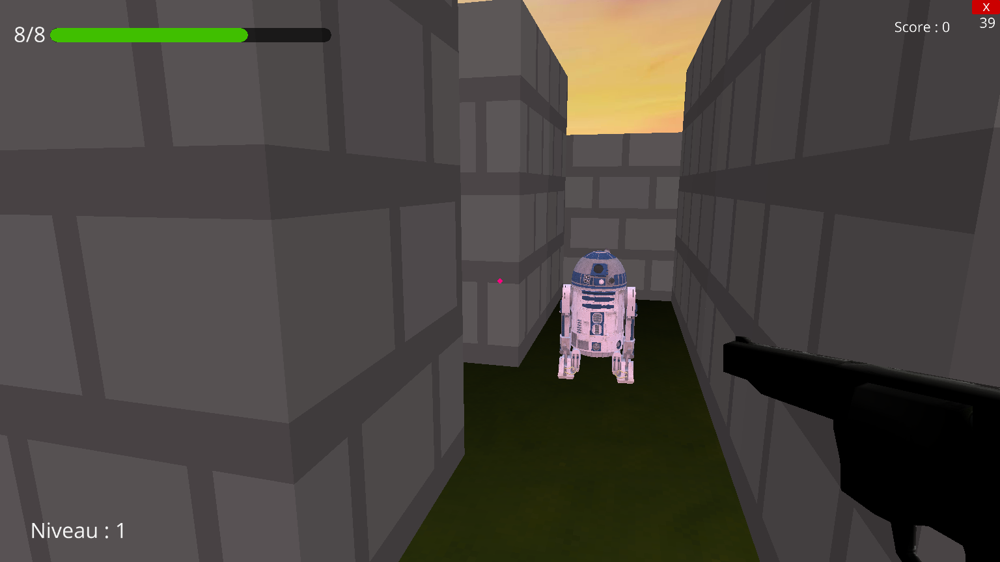

# L'Appel du Devoir !!

### Introduction
Vos êtes vous demandé ce à quoi ressemble une journée normale en Ohio ?  

Non ? Parfait, bienvenue dans l'Appel du Devoir !  

Dans ce jeu vous serez déployé dans une simulation extrêmement réaliste dans laquelle vous devrez lutter pour votre vie et mettre en marche toutes vos fonctions cérébrales afin de survivre dans ce milieu hostile aux multiples dangers. 

En effet vous serez confrontés au plus grand cas de force majeure qu'ait connu l'humanité, le silence de la Mastercard s'est abattu et les robots câlineurs sous copyrights de Merlin l'enchanteur ont fait tomber les plus grandes institutions. 

Vous êtes le seul à pouvoir les stopper, pour se faire vous devrez résoudre leur matrice complexe tout en les combattants dans un combat sans merci où vous seul accompagné de votre fidèle .357 magnum pourra faire la différence entre un nouveau jour à vivre sur cette terre et votre fin inéluctable.

### Comment jouer ?

1. Télécharger le jeu [ici](https://github.com/ousli/Appel-du-Devoir/releases/download/v1.0.0/Appel.du.Devoir.zip) ou [ici](https://github.com/ousli/Appel-du-Devoir/archive/refs/heads/master.zip)
2. Installer ursina:
3. `pip install ursina`
4. Lancer le fichier `main.py` directement dans le dossier du jeu (ou ouvrir le dossier entier sur VSCode, pas le fichier seul, puis après lancer le fichier)

